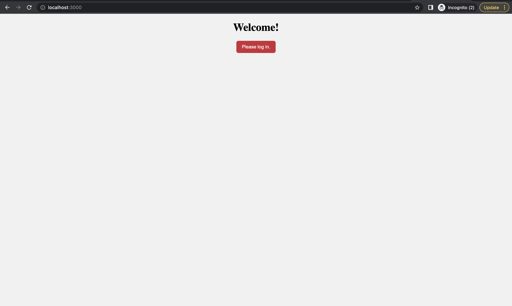
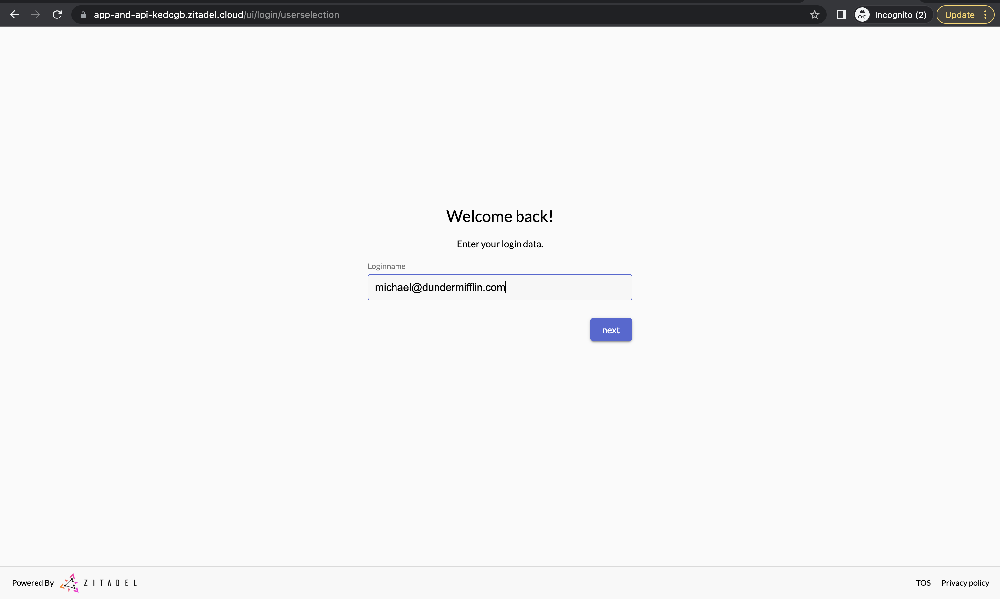
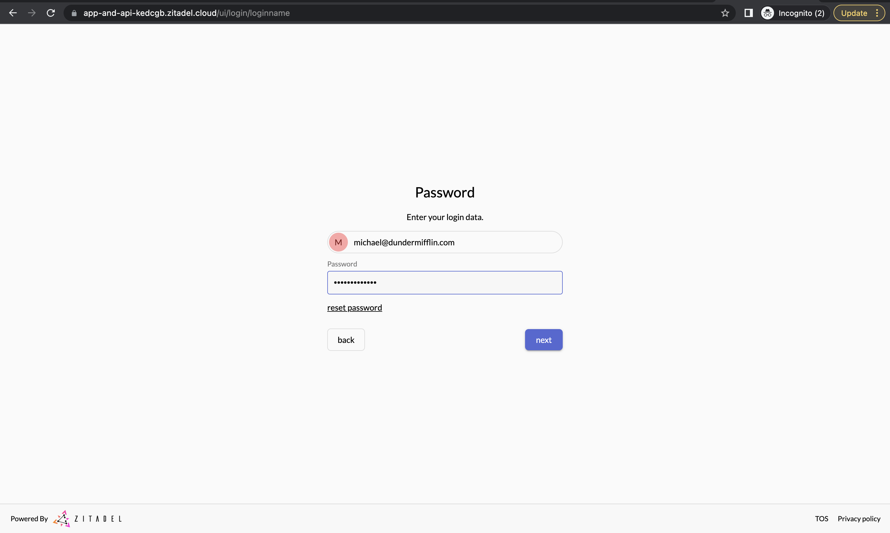
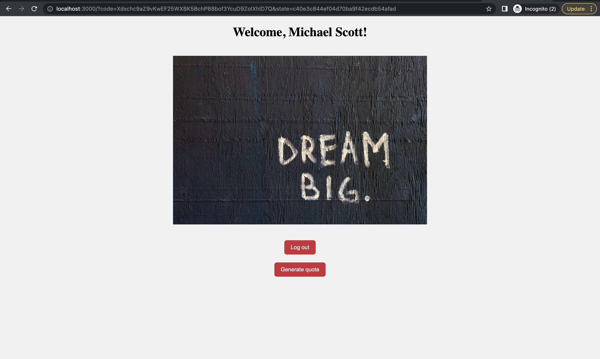
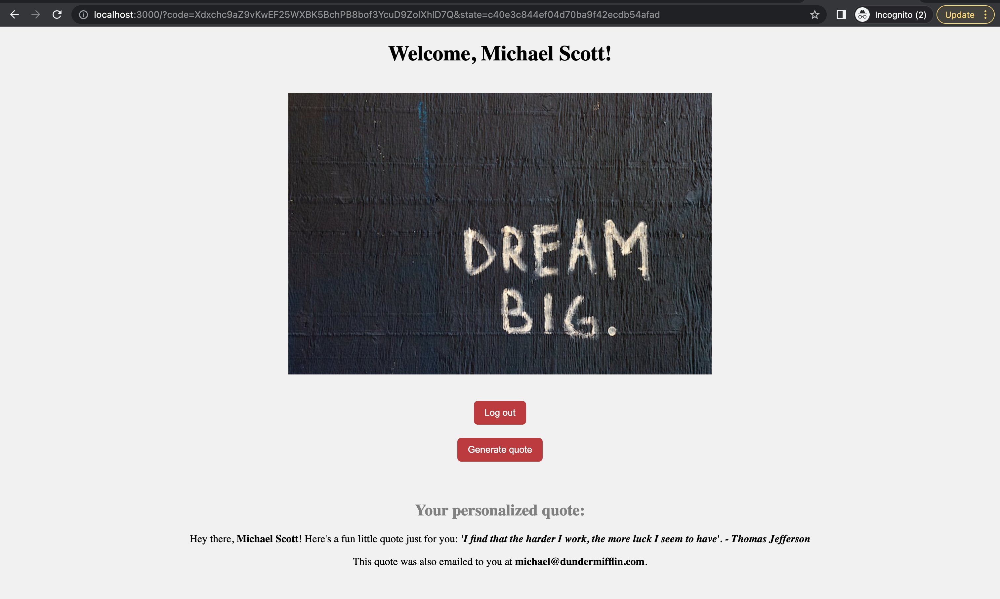
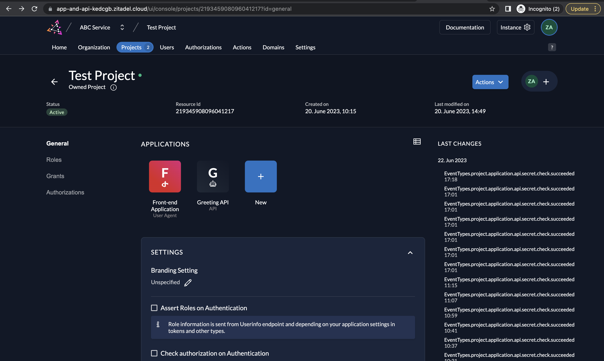
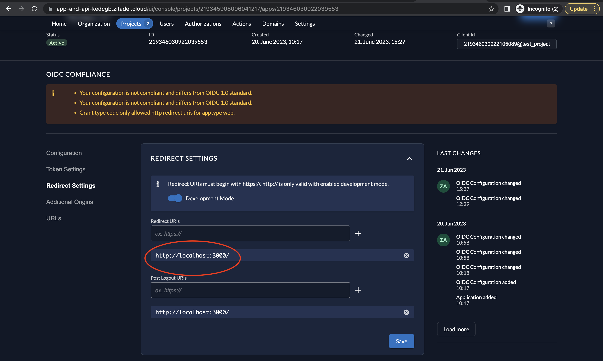
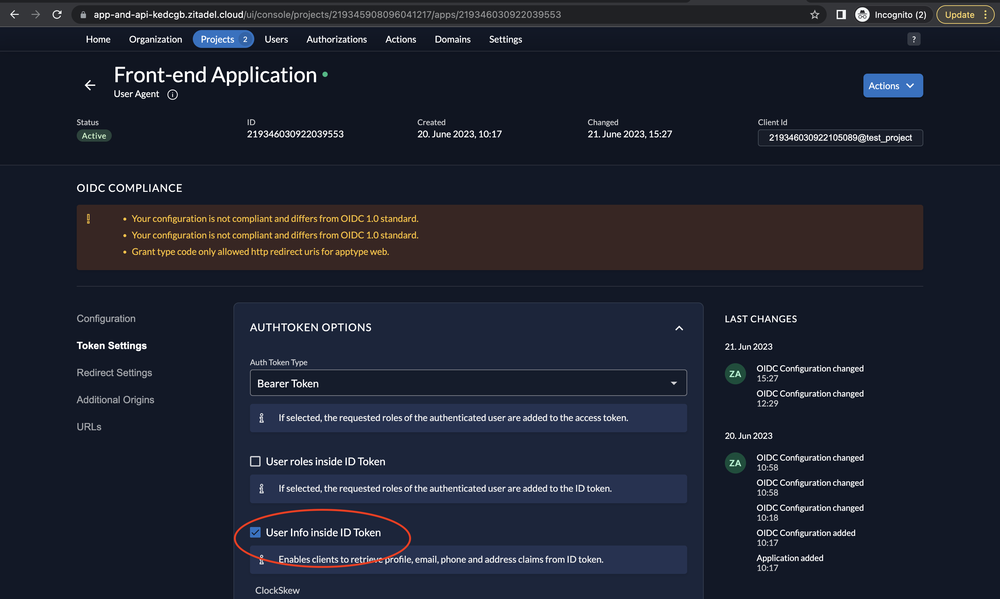

# example-quote-generator-app
A simple web application using a React front-end and a Python back-end API, both secured using ZITADEL.

## Prerequisites to run the app: 

- Have python3 and pip3 installed in your machine (for the backend)
- Have Node.js installed in your machine (for the frontend)
- Create a free ZITADEL account here - https://zitadel.cloud/
- Create an instance as explained [here](https://zitadel.com/docs/guides/start/quickstart#2-create-your-first-instance). 
- Create a new project in your instance by following the steps [here](https://zitadel.com/docs/guides/start/quickstart#2-create-your-first-instance).

## Running the backend

### Register the API in ZITADEL

Follow these [instructions](https://github.com/zitadel/examples-api-access-and-token-introspection/tree/main/api-basic-authentication#1) to register an API application with Basic Authentication in ZITADEL.

### Run the API 

The API has a single route:

- "/api/custom_quote" - A valid access token is required.

1. Create a folder named backend and add all the files in [/backend](https://github.com/zitadel/example-quote-generator-app/tree/main/backend) into it. 
2. cd to the backend directory: `cd backend`
3. Create a new virtual environment for this project by running `python3 -m venv env`.
4. Install required dependencies by running `pip3 install -r requirements.txt` on your terminal.
5. Replace the values of ZITADEL_DOMAIN, ZITADEL_INTROSPECTION_URL, API_CLIENT_ID and API_CLIENT_SECRET in the .env file with your values you obtained earlier. 
6. Run the API by running `python3 server.py` in the terminal.

### Obtain an access token via service user

1. Create a service user as instructed [here]([https://github.com/zitadel/examples-api-access-and-token-introspection/tree/main/service-user-client-credentials](https://github.com/zitadel/examples-api-access-and-token-introspection/tree/main/service-user-client-credentials#2-create-a-service-user-with-client-credentials-in-zitadel-)https://github.com/zitadel/examples-api-access-and-token-introspection/tree/main/service-user-client-credentials#2-create-a-service-user-with-client-credentials-in-zitadel-). You can skip creating the role and authorization.
2. Obtain a token by running the client-credentials-token-generator.py as instructed [here](https://github.com/zitadel/examples-api-access-and-token-introspection/tree/main/service-user-client-credentials#3-generate-a-token-). You can perform the instructions in this directory in a different terminal.

### Test the API with the access token

1. Invoke the API using the following cURL command:
`curl -X GET -H "Authorization: Bearer $TOKEN" http://localhost:5000/api/custom_quote`

2. You should get a response with Status Code 200 in the following format: 
`{"quote":"If you're going through hell, keep going. - Winston Churchill"}`

Now the API is ready to be consumed by our front-end application. 

## Running the frontend

1. Follow the ZITADEL [Quickstart Guide](https://zitadel.com/docs/guides/start/quickstart) up to [Create your React application with ZITADEL OIDC PKCE authentication](https://zitadel.com/docs/guides/start/quickstart#create-your-react-application-with-zitadel-oidc-pkce-authentication). We will go through the steps to create the React app for this tutorial below. But before that, here are some changes to note:
    - Since you already created an instance and project for the backend, you can use the same project to create the Single Page Application in ZITADEL (or you can follow the guide and create a new project altogether as well). The front-end application and API application were both created in the same ZITADEL project for this app.

    - Also, you do not need to create roles and authorizations as stated in the Quickstart.
    - Also make sure to modify the Zitadel redirect_uri configuration to be just `http://localhost:3000/` (the Quickstart guide uses `http://localhost:3000/callback`).

    - You must also go to Token Settings in the front-end app and select User Info inside ID Token as shown below:

3. Navigate to the folder where you want to create the React app. 
4. Run the following command to create a new React app named "zitadel-app": `npx create-react-app zitadel-app`
5. Navigate to the "zitadel-app" folder: `cd zitadel-app`
6. Install the dependencies by running the following: `npm install --save jwt-decode oidc-client-ts react react-dom react-router-dom`\
7. Replace the content in your `App.js` file with [src/App.js](https://github.com/zitadel/example-quote-generator-app/blob/main/frontend/src/App.js).
8. Create a file named `Login.js` and paste the code in [src/Login/js](https://github.com/zitadel/example-quote-generator-app/blob/main/frontend/src/Login.js).
9. Create a file named `authConfig.js` and add to it the content from [src/authConfig.js](https://github.com/zitadel/example-quote-generator-app/blob/main/frontend/src/authConfig.js). Edit the file by adding your values your obtained from ZITADEL. Make sure the PROJECT_ID in the scope is replaced with the project ID of the project where your API resides.
10. Add a new file called style.css to the src folder to apply CSS styling to the pages. Copy paste the code from [src/style.css](https://github.com/zitadel/example-quote-generator-app/blob/main/frontend/src/style.css).
11. Create a folder called images and add the image in the [/images](https://github.com/zitadel/example-quote-generator-app/tree/main/frontend/src/images) folder.
12. Add the line `"proxy": "http://localhost:5000"` to your `package.json` file so that it looks something like this:
    `{
  "name": "my-app",
  "version": "0.1.0",
  "private": true,
  "proxy": "http://localhost:5000",
  "dependencies": {
    "react": "^17.0.1",
    "react-dom": "^17.0.1",
    "react-scripts": "4.0.1",
    //...
  },
  //...
}
`
The "proxy" field in package.json tells the development server to proxy any unknown requests to the specified address. This helps us bypass CORS issues because the requests will be served from the same domain as far as the client (browser) is concerned.
So, in the React code, the fetch request looks like:

`fetch('/api/custom_quote')
  .then(response => response.json())
  .then(data => this.setState({ quote: data.quote }));`

Please note that this only works when you're running your React app using the development server with `npm start` or `yarn start`. 

 
